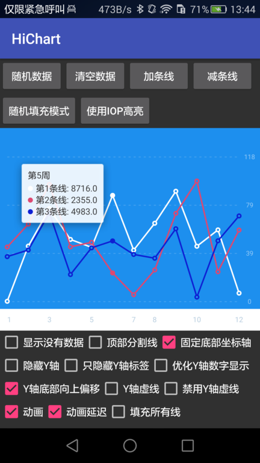

HiChart 
===
[  ](https://bintray.com/msdx/maven/HiChart/_latestVersion)


HiChart 是一个显示折线图的图表库，目前只支持折线图的绘制。

## 效果预览


## 如何使用
在项目根目录的build.gradle中添加以下声明。
```groovy
allprojects {
    repositories {
        jcenter() // 使用非SNAPSHOT版本
        maven { url "http://oss.jfrog.org/oss-snapshot-local/" } // 使用SNAPSHOT版本
    }
}
```

添加依赖 （将版本号改为当前最新版本）：
```groovy
implementation 'com.githang.hichart:hichart-core:0.3.1'
```

或使用SNAPSHOT版本：
```groovy
implementation 'com.githang.hichart:hichart-core:0.3.1-SNAPSHOT'
```

详细使用见demo以及javadoc.

## JavaDoc

https://msdx.github.io/hi-chart
